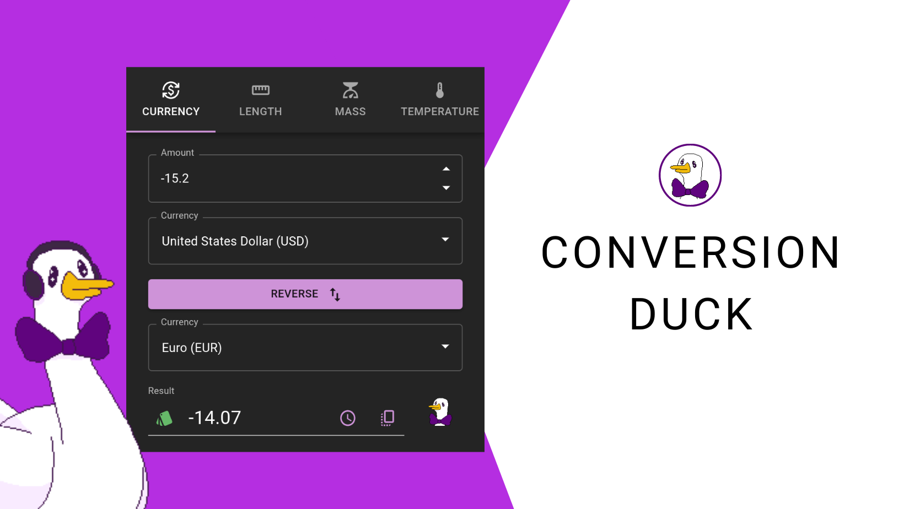

# Conversion Duck

A Chrome extension for converting currency, length, mass and temperature.

## Description

This is an extension of mine that I've decided to make source-available. The frontend code was last altered on May 20, 2023.

Get the extension from the [Chrome Web Store](https://chromewebstore.google.com/detail/conversion-duck/gmmmfkfijagbmdcnbmfiehhdcpioipmm).

The extension works offline, but when online, it gets new currency rates from my API. The API gets updated rates every hour.

This source-available repo includes a simple Express server I originally used for hosting. In production, the backend now uses a serverless architecture on AWS (Lambda, S3, and CloudFront), but functions similarly.
